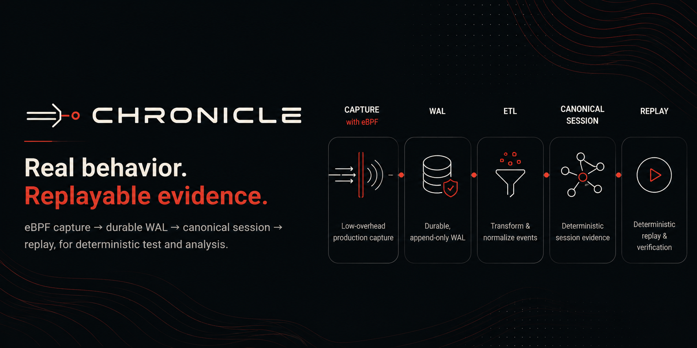

# Chronicle

Chronicle records deterministic fixtures or Linux eBPF socket evidence through a bounded, segmented WAL, reconstructs bounded HTTP/1.1 sessions, persists them locally, inspects them safely, and replays only to an explicitly authorized loopback target. PostgreSQL, S3, TLS, and protocols other than HTTP/1.1 remain outside P1.

> **Safety:** production capture can contain credentials and personal data. Replay can execute writes and publish messages. Current replay policy defaults to dry-run and denies every operation. Never point replay at a recorded production destination.

## Current implementation

The public surface is a five-command, intent-oriented CLI — `record`, `replay`, `list`, `inspect`, `doctor` — operating on recordings with stable IDs instead of session IDs and storage paths. Recording production HTTP/1.1 traffic on Linux is one command: `chronicle record -- ./my-app`. Recordings get a stable `rec_<uuid>` identity, optional human-readable names, `latest` resolution, and a default data directory (`$XDG_DATA_HOME/chronicle` or `~/.local/share/chronicle`); a private catalog and recording-intent sidecars track status, and recovery/finalization/publication can be retried with `record --retry RECORDING`.

The underlying P1 machinery is unchanged: fixture and Linux eBPF Capture Event v1, endpoint/role provenance, CRC32C segmented WAL v1 with in-WAL commit markers, bounded ingest and loss windows, crash recovery, restartable ETL, Canonical Session v1, atomic filesystem publication, safe inspect, and strict loopback replay. The 0.1.x surface (`recorder`, `recorder-status`, `etl`, fixture recording, and legacy `--source`/`--wal-dir`/`--root` flag forms) survives only as hidden compatibility entrypoints routing into the same application services, targeted for removal at 0.2. Fake remains available for rootless tests.

All internal MVP artifacts use one mutable v1 until explicit compatibility freeze. Readers reject other versions; repository fixtures, tests, and docs change together rather than adding compatibility dispatch.

HTTP support is deliberately narrow: plaintext HTTP/1.1, origin-form requests, exact `Content-Length`, bounded chunked responses, trusted close-delimited responses, and sequential keep-alive exchanges. HTTP/2+, TLS decryption, redirects, pipelining, upgrades, chunked requests, and recorded credentials remain unsupported.

## Architecture

```text
capture -> WAL -> ETL -> session reconstruction -> protocol registry
                                    |                  |
                                    v                  v
                              canonical session -> storage
                                    |
                                    v
                        replay planner -> adapter -> verifier
```

Replay depends only on canonical sessions and protocol interfaces. It does not depend on capture, WAL, or eBPF. See [architecture](docs/architecture.md).

## Protocol target matrix

A registered protocol is scaffolding, not support. Only Fake and bounded HTTP/1.1 are functional end to end.

| Protocol | Detection | Decode | Canonicalize | Replay | Verify |
| --- | ---: | ---: | ---: | ---: | ---: |
| Fake (functional scaffold) | Available | Available | Available | Available | Available |
| HTTP/1.1 | Available | Available | Available | Available | Available |
| PostgreSQL | Planned | Planned | Planned | Planned | Planned |
| MySQL | Planned | Planned | Planned | Planned | Planned |
| MariaDB | Planned | Planned | Planned | Planned | Planned |
| Oracle Net/TNS | Research | Research | Planned | Research | Research |
| MongoDB | Planned | Planned | Planned | Planned | Planned |
| Kafka | Planned | Planned | Planned | Planned | Planned |
| NATS | Planned | Planned | Planned | Planned | Planned |

MySQL and MariaDB share an explicit MySQL-family boundary. S3 API capture uses HTTP/1.1; S3-compatible artifact storage is a separate concern.

## Known limitations

- Live capture is Linux-only: cgroup v2, kernel 6.1+, BTF, supported x86_64/aarch64, and required eBPF privileges/hooks are required. macOS and rootless CI use fixture capture, ETL, inspect, replay, and eBPF compile checks only.
- Recording is bounded to 10 minutes by default (maximum 60 minutes) and a 4 GiB physical WAL ceiling. It is not always-on, rotating, incremental, or distributed capture.
- Loss windows are temporal and unattributed. Capture and WAL-limit loss can make overlapping operations incomplete; operations proven outside windows may remain replayable.
- Only plaintext is decodable. Arbitrary TLS ciphertext captured from TCP remains opaque.
- Stateful authentication, prepared statements, multiplexing, compression, and future protocols are not implemented. Captured credentials are stripped; optional Authorization replacement names an environment variable but never stores its value.
- WAL/session files can contain sensitive headers and bodies. P1 does not promise encryption at rest, secret discovery, comprehensive redaction, or tenant isolation.
- Preserve-timing scheduling is modeled, not executed.

## Local HTTP demo

On Linux, the public flow is command-mode record, then list/inspect, then replay to an authorized loopback target:

```bash
cargo run -p chronicle-cli -- record --name demo -- ./my-app
cargo run -p chronicle-cli -- list
cargo run -p chronicle-cli -- inspect latest
cargo run -p chronicle-cli -- replay latest -- ./my-app
```

`record --` starts the application only after capture attachment and, on exit, finalizes the WAL, runs ETL, and publishes the canonical session automatically. Command-mode replay (`replay RECORDING -- COMMAND...`) plans first, starts the application in a supervised cgroup, discovers its unique loopback listener, and reuses the existing replay executor; writes still require `--allow-write`.

For manual replay verification against a fixed target, run `cargo run -p chronicle-application --example http_test_server -- 18080`, then replay with `--target http://127.0.0.1:18080 --allow-host 127.0.0.1 --allow-read --execute`. Never use recorded destinations.

On macOS and rootless CI (no live eBPF capture), fixtures are safe, credential-free test input through the hidden 0.1.x compatibility form:

```bash
cargo run -p chronicle-cli -- record --source fixture --input fixtures/http/basic-session.json --root /tmp/chronicle-demo
# output prints session_id
cargo run -p chronicle-cli -- inspect <session-id> --root /tmp/chronicle-demo
```

## Development

Prerequisites: Rust version selected by `rust-toolchain.toml`. Linux with cgroup v2/BTF and documented privileges is required only for live eBPF recording; rootless tests require no external services.

```bash
cargo build --workspace
cargo test --workspace --all-features
cargo run -p chronicle-cli -- doctor
```

`doctor` runs non-destructive platform, eBPF, WAL/output, protocol, and replay-policy probes. Omitted paths remain optional `not_checked`; it never starts capture, repairs files, or sends replay traffic.

Required gates:

```bash
cargo fmt --all --check
cargo check --workspace --all-targets
cargo clippy --workspace --all-targets --all-features -- -D warnings
cargo test --workspace --all-features
```

Rootless CI runs workspace tests and isolated eBPF compilation. Real eBPF runtime coverage is opt-in through `./scripts/acceptance.sh --profile p1|p2 --executor local|multipass`; skipped privileged runs are not passed off as runtime coverage. Development evidence uses acceptance-sensitive fingerprints; `--release` requires a clean, stable current checkout and complete compatible evidence.

No checked-in configuration should contain secrets. `postgres.connection_url_env` names an environment variable rather than storing credentials.

## P1 commands

```text
record -- COMMAND...                       # supervised command mode (Linux): capture, ETL, publish
record --pid PID | --cgroup PATH           # record an already-running workload (Linux), never terminated
record --retry RECORDING                   # retry recovery/finalization/publication for a recoverable recording
record --name NAME --duration 5m -- CMD    # optional name; duration default 600s, max 3600s
list                                       # catalog table, newest first (ID NAME CREATED DURATION SESSIONS OPERATIONS STATUS)
inspect RECORDING                          # RECORDING = latest | rec_<uuid> | bare UUID | exact name
replay RECORDING --target http://LOOPBACK:PORT --allow-host LOOPBACK [--allow-read] [--allow-write] [--execute]
replay RECORDING -- COMMAND...             # command mode: infer loopback target via listener discovery
record-fixture --input FILE --root ROOT    # hidden 0.1.x fixture capture (see internal namespace below)
doctor                                     # non-destructive probes with actionable remediation
```

`latest` resolves to the newest published recording; unresolved references exit 3. Replay stays dry-run unless `--execute` and matching loopback/effect gates are supplied, and never targets a recorded production destination. Global options: `--format human|json` and `--data-dir`. Command-mode record defaults to 600 seconds and a 4 GiB WAL ceiling; it finalizes the WAL, runs ETL, and publishes the canonical session automatically.

Hidden 0.1.x compatibility entrypoints (removal targeted 0.2): `internal recorder`, `internal recorder-status`, `internal etl --wal-dir DIR --output ROOT`, `internal record-fixture --input FILE --root ROOT`, and legacy `record --source fixture|ebpf`, `replay SESSION --root ROOT`, `inspect SESSION --root ROOT` forms. See [P1 operations](docs/operations.md).

## MVP direction

Future work: PostgreSQL/S3 persistence, replay scheduling, redaction before remote persistence, retention, additional protocol codecs, and removal of the deprecated 0.1.x compatibility entrypoints at 0.2.

Dynamic shared-library plugins, TLS decryption, HTTP/2, WAL replication, UI, and additional infrastructure are outside initialization scope.

Licensed under Apache-2.0. See [CONTRIBUTING.md](CONTRIBUTING.md).
